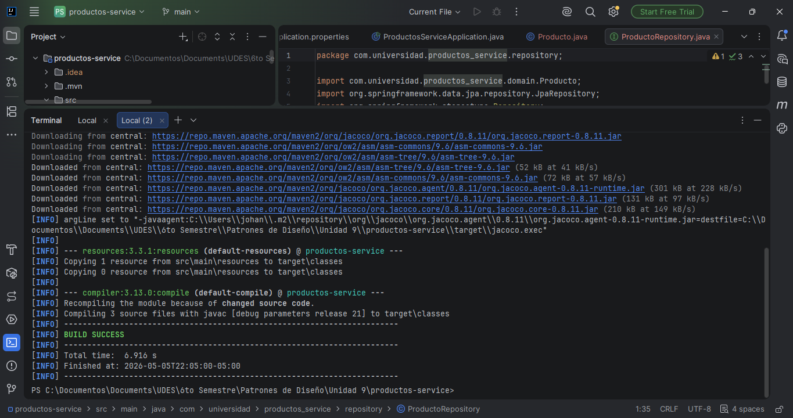
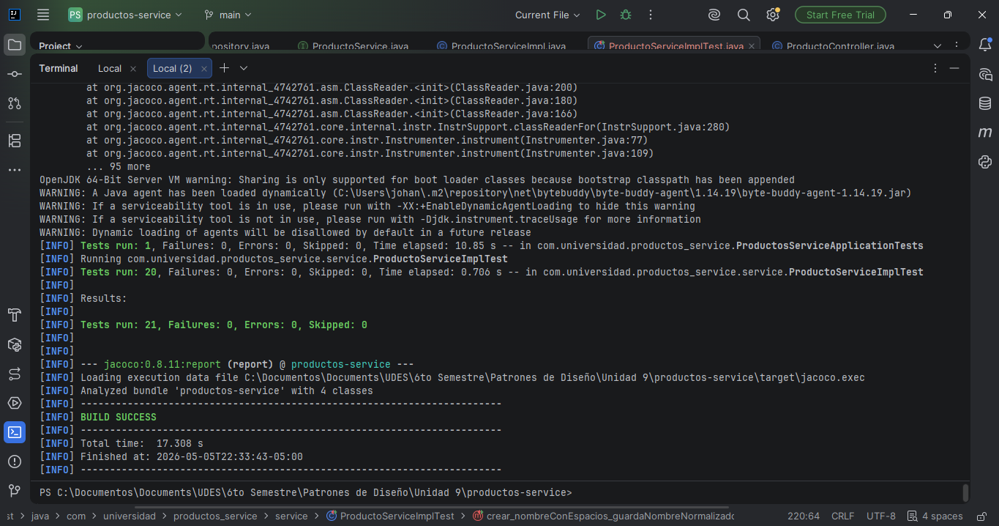
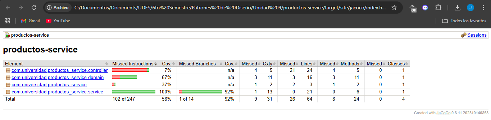
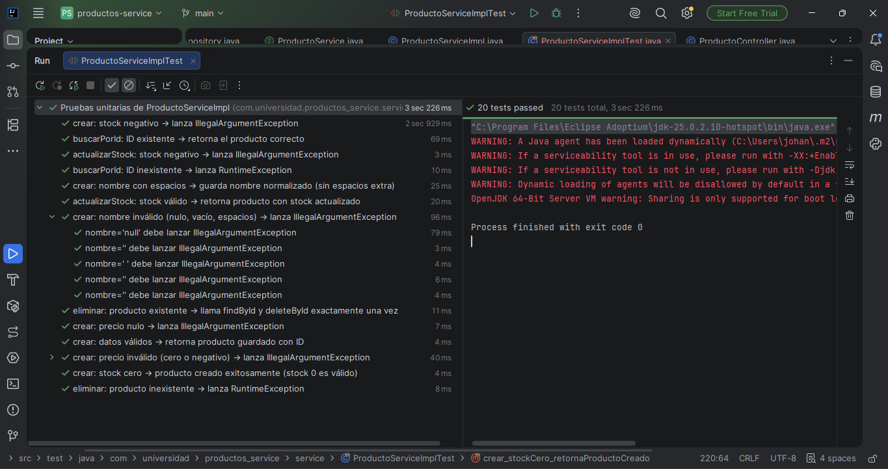

# productos-service — Post-Contenido 1, Unidad 9

**Patrones de Diseño de Software**  
Ingeniería de Sistemas — Universidad de Santander (UDES) — 2026  
Estudiante: Johan Carreño

---

## Descripción del Proyecto

Microservicio de gestión de productos desarrollado con **Spring Boot 3.3**, que implementa una capa de pruebas unitarias completa sobre la lógica de negocio del servicio. El proyecto aplica **JUnit 5** y **Mockito** para aislar y verificar el comportamiento del servicio sin depender de la base de datos real.

### Tecnologías utilizadas

- Java 21
- Spring Boot 3.3.x
- Spring Data JPA
- H2 Database (en memoria)
- Lombok
- JUnit 5 (vía Spring Boot Starter Test)
- Mockito 5
- JaCoCo (reporte de cobertura)
- Maven
---

## Instrucciones de Ejecución

### Prerrequisitos
- JDK 21 instalado y en el PATH
- Maven 3.9+
- Git

### 1. Clonar el repositorio

```bash
git clone https://github.com/Johan09CD/Carre-o-post1-u9-Patrones
```

### 2. Compilar el proyecto

```bash
mvn compile
```

### 3. Ejecutar las pruebas unitarias

```bash
mvn test
```

### 4. Generar reporte de cobertura JaCoCo

```bash
mvn test jacoco:report
```

Abre en el navegador: `target/site/jacoco/index.html`

### 5. Ejecutar la aplicación

```bash
mvn spring-boot:run
```

La aplicación estará disponible en: `http://localhost:8080`

### Endpoints disponibles

| Método | URL | Descripción |
|--------|-----|-------------|
| POST | `/api/productos?nombre=X&precio=Y&stock=Z` | Crear producto |
| GET | `/api/productos/{id}` | Buscar por ID |
| PUT | `/api/productos/{id}/stock?nuevoStock=N` | Actualizar stock |
| DELETE | `/api/productos/{id}` | Eliminar producto |

---

## Descripción de las Pruebas

La suite `ProductoServiceImplTest` cubre los siguientes escenarios:

### Casos exitosos (Happy Path)
| Prueba | Descripción |
|--------|-------------|
| `crear_datosValidos_retornaProductoGuardado` | Verifica creación correcta y que `save()` es llamado una vez |
| `buscarPorId_existente_retornaProducto` | Verifica retorno del producto cuando el ID existe |
| `actualizarStock_stockValido_retornaProductoActualizado` | Verifica actualización de stock con valor válido |
| `crear_stockCero_retornaProductoCreado` | Verifica que stock=0 es un valor válido |

### Casos de error
| Prueba | Descripción |
|--------|-------------|
| `buscarPorId_noExistente_lanzaRuntimeException` | Verifica excepción cuando el ID no existe |
| `crear_nombreInvalido_lanzaIllegalArgumentException` | Parametrizada: null, vacío, espacios, tab, newline |
| `crear_precioInvalido_lanzaIllegalArgumentException` | Parametrizada: 0.0, -1.0, -100.0, -0.01 |
| `crear_stockNegativo_lanzaIllegalArgumentException` | Verifica excepción con stock negativo |
| `crear_precioNulo_lanzaIllegalArgumentException` | Verifica excepción con precio null |
| `actualizarStock_stockNegativo_lanzaIllegalArgumentException` | Verifica excepción al actualizar con stock negativo |
| `eliminar_productoInexistente_lanzaRuntimeException` | Verifica que `deleteById` no se llama si el producto no existe |

### Verificación avanzada (ArgumentCaptor)
| Prueba | Descripción |
|--------|-------------|
| `crear_nombreConEspacios_guardaNombreNormalizado` | Verifica que `strip()` se aplica antes de persistir |
| `eliminar_productoExistente_llamaDeleteById` | Verifica secuencia: `findById` y `deleteById` llamados exactamente una vez |

---

## Evidencia de Pruebas en Verde

### BUILD SUCCESS


### Resultado de `mvn test`


### Reporte de cobertura JaCoCo


### Pruebas en verde en el IDE


---

## Conceptos Aplicados

- **@Mock / @InjectMocks**: Aislamiento de la capa de servicio respecto al repositorio JPA
- **@ParameterizedTest**: Reutilización de pruebas con múltiples valores de entrada sin duplicar código
- **ArgumentCaptor**: Inspección de los objetos exactos pasados al mock para verificar transformaciones internas
- **verifyNoInteractions**: Confirmación de que el repositorio no es invocado cuando una validación falla
- **thenAnswer**: Simulación dinámica del comportamiento del repositorio al guardar